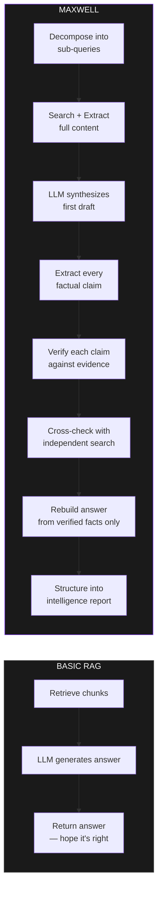
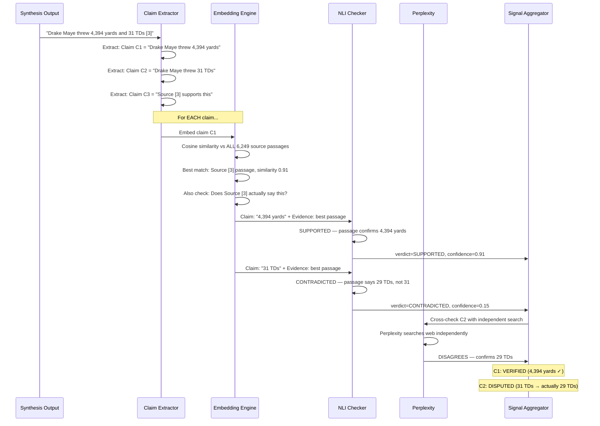
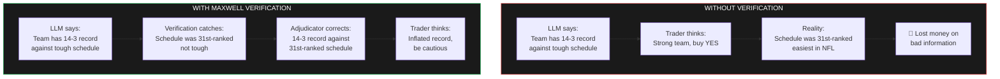
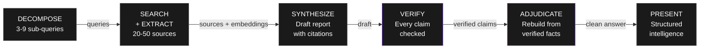

# Maxwell Pipeline — Explained for the Team

## The Short Version

**A basic RAG system trusts the LLM. Maxwell doesn't.**

A RAG system retrieves documents, feeds them to an LLM, and hopes the answer is correct. Maxwell retrieves documents, generates an answer, then **puts every claim on trial** — checking each one against the actual evidence before producing the final output.

---

## What a Basic RAG System Does

**3 steps. That's it.**

1. User asks a question
2. System finds relevant document chunks (via embeddings + cosine similarity)
3. LLM reads the chunks and generates an answer with "[source]" references

**The problem:** The LLM will confidently cite Source [3] while saying something Source [3] never actually said. It hallucinates facts, invents numbers, and misattributes claims — all while looking perfectly cited. There's no check. You just trust it.

---

## What Maxwell Does

```mermaid
flowchart TD
    Q([User Question + Market Data]) --> D

    subgraph Phase1["PHASE 1 · DECOMPOSE"]
        D[LLM breaks question into\n3-9 targeted sub-queries\neach with topic, depth, time range]
    end

    D --> S

    subgraph Phase2["PHASE 2 · SEARCH + EXTRACT"]
        S[Parallel Tavily searches\nacross all sub-queries] --> F[Filter: remove low-relevance\nresults + blocked domains]
        F --> E[Tavily Extract: fetch full\npage content for top 5 sources]
        E --> EMB[Pre-embed ALL passages\ninto vectors for later use]
    end

    EMB --> SYN

    subgraph Phase3["PHASE 3 · SYNTHESIZE"]
        SYN[LLM reads ALL sources\nand writes a detailed\nintelligence report with citations]
    end

    SYN --> CL

    subgraph Phase4["PHASE 4 · VERIFY — This is what makes Maxwell different"]
        CL[Extract every factual\nclaim from the report] --> COS[For each claim:\ncompute cosine similarity\nagainst ALL source passages]
        COS --> NLI[For each claim + best evidence:\nNLI entailment check\nSUPPORTED / CONTRADICTED / NEUTRAL]
        NLI --> NUM[Numeric consistency check:\ndo the numbers actually match?]
        NUM --> PX[Perplexity cross-check:\nindependent search engine\nverifies key claims]
        PX --> AGG[Aggregate all signals\ninto confidence score per claim]
    end

    AGG --> ADJ

    subgraph Phase5["PHASE 5 · ADJUDICATE"]
        ADJ[New LLM call that ONLY uses:\n✓ Verified facts\n✗ Corrected contradictions\n? Hedged uncertain claims\nProduces final clean answer]
    end

    ADJ --> PR

    subgraph Phase6["PHASE 6 · PRESENT"]
        PR[Transform into structured\nMaxwellIntelligence JSON:\nassessment, thesis, outcomes,\nverification scores, sources]
    end

    PR --> OUT([Final Intelligence Report\nwith confidence scores])

    style Q fill:#7C3AED,stroke:#7C3AED,color:#fff
    style OUT fill:#7C3AED,stroke:#7C3AED,color:#fff
    style Phase4 fill:#111,stroke:#7C3AED,color:#fff
```

**6 phases. The magic is Phase 4.**

---

## Side-by-Side Comparison

| | Basic RAG | Maxwell |
|---|---|---|
| **Search** | Single query → retrieve chunks | 3-9 targeted sub-queries in parallel |
| **Sources** | Pre-loaded document chunks | Live web search + full page extraction |
| **Synthesis** | LLM reads chunks, writes answer | LLM reads ALL sources, writes detailed report |
| **Verification** | ❌ None. Trust the LLM. | ✅ Every claim extracted and checked |
| **Hallucination check** | ❌ None | ✅ Cosine similarity + NLI entailment + numeric check |
| **Independent check** | ❌ None | ✅ Perplexity cross-validates key claims |
| **Final answer** | Raw LLM output | Rebuilt from ONLY verified facts |
| **Confidence** | None | Per-claim confidence score (0-100%) |
| **Output** | Text blob | Structured intelligence: assessment, thesis, factors, risks |

---

## The Verification Phase in Detail

This is the part your co-founder's RAG system does NOT do. Here's exactly what happens:

**This is what catches hallucinations.** The LLM confidently wrote "31 TDs" and cited Source [3]. A basic RAG would pass that through. Maxwell catches it because:

1. It embeds the claim and finds the actual passage in Source [3]
2. NLI entailment check compares "31 TDs" vs what the passage actually says ("29 TDs")
3. Perplexity independently confirms it's 29, not 31
4. The adjudicator receives "CONTRADICTED: 31 TDs → actually 29 TDs" and uses the correct number

---

## Why This Matters for Making Money

---

## The Full Pipeline at a Glance

**Phase 4 (Verify) and Phase 5 (Adjudicate) are what no basic RAG system does.** That's Maxwell's moat.

---

## TL;DR for the Team

**RAG = "Here's what the LLM thinks the documents say"**
**Maxwell = "Here's what the documents actually say, verified claim by claim"**

Your co-founder's RAG system retrieves chunks and lets the LLM reference them. Maxwell does that AND THEN puts every single claim on trial — checking it against the actual source text, running an independent search to cross-validate, and only including facts that survive verification. The final answer is rebuilt from scratch using only verified information.

That's not a RAG. That's a verification engine with a RAG as its first step.
